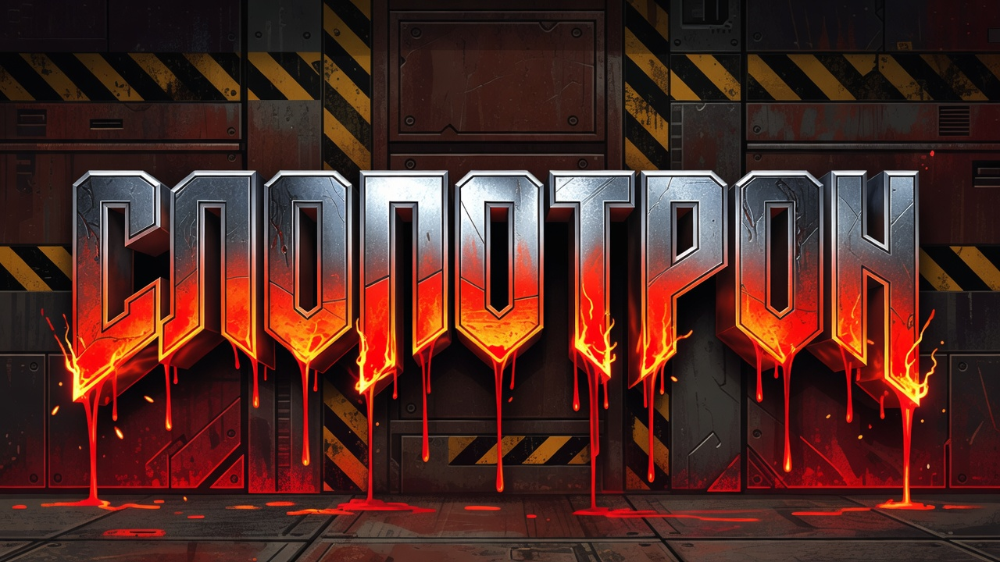
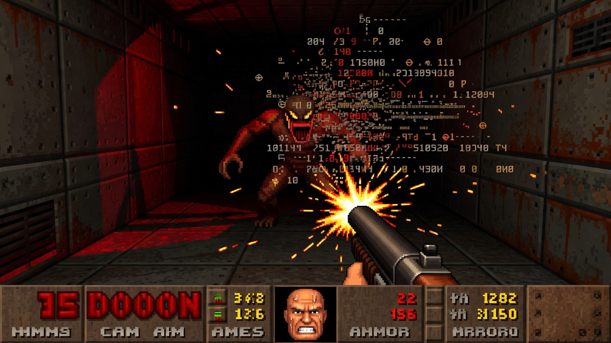

<p align="center">
  
</p>

# Слопотрон

> **Claude Code-скил (команда `/slopotron`): отстреливает из русскоязычного текста всё, что выдаёт нейросеть — канцелярит, мёртвые клише, AI-маркеры и «нейротропы». Как DOOM-марин по демонам, только мишень — нейрослоп. Два режима: подсветить флаги или зачистить на месте.**

[](LICENSE)
[](https://docs.claude.com/en/docs/claude-code/overview)

Даёте текст — Claude прогоняет его по чек-листу из ~80 признаков машинного письма,
показывает таблицу флагов с цитатами и правками и (в режиме Fix) отдаёт очищенный
текст. Не переписывает смысл и структуру — только убивает маркеры.

```
/slopotron  <вставьте текст>
→ Найдено 14 флагов (критичных: 6). Живой текст: 3/7.
→ ОЧИЩЕННЫЙ ТЕКСТ: ...
```

<p align="center">
  <br>
  <sub><i>Слопотрон против корпоративного нейрослопа</i></sub>
</p>

---

## Зачем

«Сделай менее похоже на ChatGPT» — частая правка, но руками её делать долго и
скучно: глаз замыливается, половину клише не замечаешь. Существующие де-слоп
инструменты заточены под английский. «Слопотрон» собран под **русский**: канцелярит,
кальки с английского, инфобизнес-клише, SMM-артефакты, ложная авторитетность.

И главное — он не просто вычищает, а **проверяет себя на пересушенность**: после
чистки текст часто становится стерильным и безликим. Третий проход ловит это и
оживляет текст обратно, не добавляя новых AI-паттернов.

## Как работает

В основе — **принцип кластера**: нейрослоп это статистическая перепредставленность,
а не эксклюзивность. Любой отдельный маркер встречается и у живых авторов, поэтому
сигналом считается только **скопление — 3+ маркера в одном абзаце**. Это защищает от
главной ошибки чистки — стерилизации живого текста (и люди, и автоматические детекторы
ловят AI примерно на угадайку, ~50%, а на текстах не-носителей дают 60%+ ложных
срабатываний). Список маркеров датирован (версия 2026-06) и живой: обороты «выгорают»,
как только становятся публично известны, и зависят от конкретной модели.

Три прохода:

1. **Механический чек-лист** — ~80 признаков в категориях: типографика, нейротропы,
   слова-маркеры, фразы-маркеры, структурные паттерны, стилистика.
2. **Свежий взгляд** — текст читается целиком: «что здесь всё ещё пахнет машиной?»
   Интуитивный проход поверх механики.
3. **Самопроверка** — «убрал старые паттерны, но не добавил ли новые?» Ловит
   выровненный ритм, стерильную структуру, вялую концовку, потерю голоса автора.
   Если поймал — оживляет текст.

Плюс **диагностика по «семьям проблем»** (Inflators, Fakers, кластеры AI-слов,
структурные тики, остатки чат-формата) — чтобы быстро увидеть, в какой зоне
гнездится слоп.

<p align="center">
  <br>
  <sub><i>Нейрослоп под дробовиком</i></sub>
</p>

## Режимы

| Режим | Когда | Что делает |
|-------|-------|------------|
| **Fix** (по умолчанию) | «почисти», «сделай человечнее», «/slopotron» | находит + правит + отдаёт чистый текст |
| **Detect** | «только флаги», «detect», «что выдаёт нейросеть» | только список проблем, текст не трогает |

## Установка

Скил — это два файла в папке `.claude/`. Скопируйте их в свой проект **или**
в глобальную папку Claude Code (`~/.claude/`), чтобы скил был доступен везде.

**В конкретный проект:**
```bash
git clone https://github.com/beaverbeard/slopotron.git
cp -r slopotron/.claude/skills/slopotron      .claude/skills/
cp    slopotron/.claude/commands/slopotron.md .claude/commands/
```

**Глобально (во все проекты):**
```bash
cp -r slopotron/.claude/skills/slopotron      ~/.claude/skills/
cp    slopotron/.claude/commands/slopotron.md ~/.claude/commands/
```

Перезапустите Claude Code — скил «Слопотрон» (`slopotron`) и команда `/slopotron` появятся в списке.

## Использование

```bash
# Вставить текст прямо в команду
/slopotron  Сегодня мы активно используем инновационные решения...

# Или вызвать команду и вставить текст следующим сообщением
/slopotron

# Только флаги, без правки
/slopotron только флаги: <текст>
```

Или просто словами: «прогони этот текст через слопотрон», «убери отсюда нейрослоп»,
«что здесь выдаёт нейросеть».

## Что считается слопом

Несколько примеров из чек-листа:

- **Канцелярит:** «является», «осуществлять», «обеспечивать», «способствует»
- **Нейротропы:** «активно использует», «в рамках», «это не X, а Y», «И тут...»
- **Символизм-регистр (RU):** «оставил неизгладимый след», «символизирует устойчивое влияние», «ключевой/поворотный момент»
- **AI-дисклеймеры:** «на момент моего обучения», «информация ограничена», «не широко задокументировано»
- **Ложная авторитетность:** «эксперты считают», «исследования показывают» (без источника)
- **Чат-остатки:** «Отличный вопрос!», «Надеюсь, было полезно», «Давайте разберёмся»
- **Структура:** ровный ритм предложений, академическое введение-заключение,
  тройные перечисления «быстро, просто и эффективно»
- **Кальки:** SVO-порядок слов, заглавная после двоеточия, несогласование падежей

Полный список — в [`SKILL.md`](.claude/skills/slopotron/SKILL.md).

## Настройка под себя

Скил **opinionated** и заточен под живой разговорный русский (посты, рассылки, эссе).
Раздел «Типографика» (ёлочки, никаких bold/списков в теле) подогнан под
короткие посты в мессенджерах. Под статьи, документацию или другой тон — просто
отредактируйте `SKILL.md`: это обычный Markdown, правится в любом месте.

## Ограничения

- **Только русский.** Чек-лист собран под русскоязычный текст; для английского есть
  отдельные de-slop инструменты.
- **Стиль, не факты.** Скил чистит форму, а не проверяет утверждения и не правит логику.
- **Цитаты не трогает.** Чужой текст в кавычках остаётся как есть.
- **Opinionated по умолчанию.** Часть правил — вкусовые (типографика постов); под свой
  формат их стоит подкрутить.

## FAQ

**Это переписывает мой текст?** В режиме Fix — правит точечно (убирает маркеры,
заменяет канцелярит). Не переструктурирует и не меняет смысл. Хотите без правок —
режим Detect.

**Работает с длинными текстами?** Да, но чем длиннее текст, тем полезнее сначала
прогнать Detect, посмотреть на флаги и решить, что чистить.

**А если текст и так живой?** Тогда флагов будет мало, а раздел «Живой текст: X/7»
это подтвердит. Скил не правит ради квоты — объём правок пропорционален проблемам.

## Вклад

PR и issue приветствуются. Скил — это обычный Markdown в
`.claude/skills/slopotron/SKILL.md`, менять легко. Идеи: профили под разные форматы
(статья / доки / худлит), английская версия, расширение списка нейротропов.

## Скилы для рИИдакторов

«Слопотрон» — скил для редакторов из семьи **[рИИдактор](https://redaktozavr.ru/rAIdactor?utm_source=skills)**, рассылки про
работу редактора с ИИ. Каждый скил семьи закрывает свою зону, не пересекаясь:

| Скил | Зона | Природа |
|------|------|---------|
| [Бахтин](https://github.com/beaverbeard/bakhtin) | Генерация черновика: multi-agent, 7 форматов | LLM |
| [Чуковский](https://github.com/beaverbeard/chukovsky) | Смысл, структура, голос, канцелярит | LLM |
| [Розенталь](https://github.com/beaverbeard/rozental) | Орфография, пунктуация, согласование, единообразие | LLM |
| **Слопотрон** | AI-маркеры и нейрослоп | LLM |
| [Мильчин](https://github.com/beaverbeard/milchin) | Типографика и юникод-гигиена | Скрипт |
| [Аграновский](https://github.com/beaverbeard/agranovsky) | Верификация фактов: числа, цитаты, законы, ссылки | LLM + поиск |
| [Виноградов](https://github.com/beaverbeard/vinogradov) | Сборка авторского голоса (Voice DNA) из корпуса | Скрипт + LLM |

Канонический порядок при полной вычитке:
**Чуковский → Аграновский → Слопотрон → Розенталь → Мильчин** (смысл → истина → детектор → буква → форма). Аграновский — обязательный фактчек, идёт сразу за Чуковским.

Рядом с конвейером вычитки — **[Виноградов](https://github.com/beaverbeard/vinogradov)**: он не правит текст, а собирает авторский голос (Voice DNA) из реального корпуса — тот самый, которым потом пишут и под который вычитывают остальные.

Слопотрон идёт **третьим**: снимает AI-маркеры после смысла (Чуковский) и
фактчека (Аграновский), но **перед** нормой — де-слоп переписывает куски, и норму
ставит Розенталь уже по очищенному тексту, а не наоборот.
## Лицензия

[MIT](LICENSE) © 2026 Rodion Scryabin ([@beaverbeard](https://github.com/beaverbeard))
